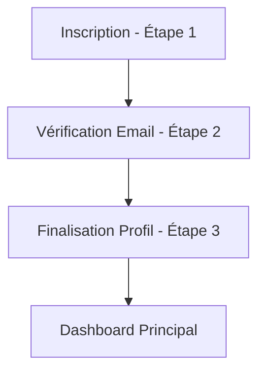

# LeyInvest - Plateforme d'Investissement BRVM

Une application web moderne pour l'investissement sur la Bourse Régionale des Valeurs Mobilières (BRVM).

## 🚀 Technologies Utilisées

- **Frontend**: React 18, TypeScript, Tailwind CSS
- **State Management**: Redux Toolkit
- **Routing**: React Router DOM
- **Forms**: React Hook Form + Zod validation
- **UI Components**: Radix UI + shadcn/ui
- **API**: Axios avec intercepteurs
- **Notifications**: React Hot Toast
- **Animations**: Framer Motion

## 📋 Fonctionnalités

### Authentification
- **Inscription en 3 étapes**:
  1. Données personnelles de base
  2. Vérification par email avec code
  3. Finalisation du profil (âge, genre, pays, profession)
- **Connexion sécurisée** avec JWT
- **Gestion des mots de passe** (changement, récupération)
- **Validation robuste** des formulaires

### Dashboard Principal
- **Vue d'ensemble** du portefeuille
- **Graphiques interactifs** des performances
- **Actions rapides** (achat/vente)
- **Notifications** en temps réel

### Portefeuille
- **Gestion des investissements**
- **Historique des transactions**
- **Performance détaillée**

### Analyses
- **Analyses de marché**
- **Recommandations d'investissement**
- **Outils d'aide à la décision**

## 🔧 Configuration

### Variables d'Environnement

Créez un fichier `.env` à la racine :

```env
VITE_API_BASE_URL=https://leyinvest-backend.onrender.com/api/v1
```

### Installation

```bash
# Installation des dépendances
npm install

# Démarrage en développement
npm run dev

# Build pour production
npm run build

# Preview du build
npm run preview
```

## 🌐 API Backend

### Endpoints d'Authentification

#### Inscription (Étape 1)
```
POST /register/step1/
```
**Données d'entrée** :
```json
{
  "nom": "string",
  "prenom": "string",
  "age": 15,
  "genre": "Homme",
  "email": "ev@gmail.com",
  "numero_whatsapp": "6345837860",
  "pays_residence": "Côte d'Ivoire",
  "situation_professionnelle": "Entrepreneur",
  "mot_de_passe": "Aaaa0000$"
}
```

#### Vérification Email (Étape 2)
```
POST /register/step2/verify-email/
```
**Données d'entrée** :
```json
{
  "email": "elishadjefie@gmail.com",
  "verification_code": "5327"
}
```

#### Finalisation Profil (Étape 3)
```
POST /register/step3/complete-profile/
```

#### Connexion
```
POST /auth/login/
```

#### Autres endpoints
- `POST /register/step2/resend-code/` - Renvoyer le code de vérification
- `POST /auth/logout/` - Déconnexion
- `POST /auth/change-password/` - Changement de mot de passe
- `GET /users/me/` - Profil utilisateur

## 🛡️ Sécurité & Validation

### Validations Frontend
- **Mots de passe** : minimum 6 caractères
- **Données numériques** : strictement positives
- **Emails** : format valide requis
- **Champs obligatoires** : validation en temps réel

### Gestion d'Erreurs
- **Erreurs réseau** : détection CORS, timeout, connexion
- **Erreurs API** : codes HTTP spécifiques avec messages français
- **Retry automatique** : tentatives de reconnexion
- **Messages utilisateur** : erreurs traduites et contextuelles

## 📱 Interface Utilisateur

### Design System
- **Tokens sémantiques** : couleurs, typographie, espacements cohérents
- **Mode sombre/clair** : basculement automatique
- **Responsive** : mobile-first avec breakpoints Tailwind
- **Accessibilité** : ARIA labels, navigation clavier

### Composants Personnalisés
- `LeyButton` - Boutons avec états de chargement
- `LeyInput` - Champs avec validation visuelle
- `LeySelect` - Sélecteurs stylisés
- `LeyCard` - Cartes d'information
- `TradeModal` - Modal d'achat/vente unifié

## 🔄 Workflow d'Inscription



## 📊 État de l'Application (Redux)

### Store Structure
```typescript
interface RootState {
  auth: {
    isAuthenticated: boolean;
    user: User | null;
    loading: boolean;
    error: string | null;
    registrationEmail: string | null;
  };
  portfolio: {
    // Données du portefeuille
  };
}
```

## 🚦 Scripts Disponibles

- `npm run dev` - Serveur de développement
- `npm run build` - Build de production
- `npm run preview` - Aperçu du build
- `npm run lint` - Vérification ESLint
- `npm run type-check` - Vérification TypeScript

## 📞 Support

Pour toute question ou problème :
- **Email** : support@leyinvest.com
- **Documentation API** : Swagger disponible sur l'endpoint backend
- **Issues** : Utiliser le système de tickets du projet

---

*Développé avec ❤️ pour la communauté d'investisseurs BRVM*